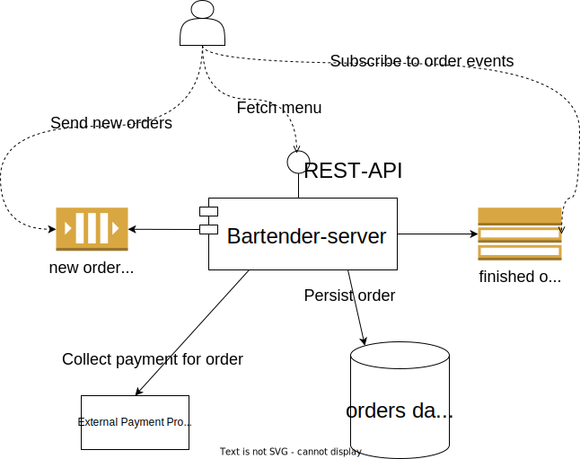

# Course Material for End-to-End Testing a Kotlin Backend


**Example case:** Bartender Server. 🍻

Responsible for:

1. Providing a menu of drinks on a REST API
2. Collecting incoming orders from a message queue
3. Persisting orders in a database for bookkeeping
4. Collecting payment for orders using a payment-provider
5. Sending events to a topic when an order is ready

## Documentation

More information is found here:

- [Slideshow](https://docs.google.com/presentation/d/1t3tc1KePlF6EUdAyNJj3eaHl6DipFOLNx-kdugog6j0/edit?usp=sharing) (
  Google docs)

### Architecture



You can see that the 5 responsibilities also require 4 external systems (queue, database, topic),
and it provides a service for external users (REST-API).

We need end-to-end tests to have *some* confidence that our backend works with these external systems.
Mocking them in tests will not be good enough.

(For *real confidence*, you can go even further and create **system tests**, where you inject data into a real, deployed
AWS account as part of your CD-pipeline. This is out of scope for this course.)

#### Organization of code

The `Main`-file starts the application.
It loads a `Config` into an `App`.
The app starts serving the REST-API, and starts a `SqsPoller` to read from its SQS queue.

The API provides the output of `GetDrinkMenuRoute`.

The SQS poller loops forever, fetching new messages and sending them to a queue processor named `OrderQueueProcessor`.
The `OrderQueueProcessor` coordinates several services and persists to the database.
Then, an event is sent out using `OrderReadyNotifyer`.

## Getting started

### Tool dependencies

You need to install:

- Docker
- Maven (or run maven through IntelliJ)
- JDK 17
  - `brew tap homebrew/cask-versions` and then`brew install --cask temurin17`

### Developer machine setup

#### GitHub Packages

Create a personal access token (classic) with at least `packages:read` scope:
https://github.com/settings/tokens/new?scopes=packages:read .
Copy the generated token.

Add a token to maven ( `~/.m2/settings.xml` ) for GitHub Packages:

```xml
<?xml version="1.0" encoding="UTF-8"?>
<settings xmlns="http://maven.apache.org/SETTINGS/1.0.0"
          xmlns:xsi="http://www.w3.org/2001/XMLSchema-instance"
          xsi:schemaLocation="http://maven.apache.org/SETTINGS/1.0.0
                      https://maven.apache.org/xsd/settings-1.0.0.xsd">

  <servers>
    <server>
      <id>github</id>
      <username>my-username-on-github</username>
      <password>123_abc-my-secret-token-here</password>
    </server>
  </servers>

</settings>
```

#### Git Clone

```shell
git clone git@github.com:krissrex/capra-e2e-testing-kotlin-backend-course.git
```

**IntelliJ** → `File` → `New` → `Project from existing sources...` → `capra-e2e-testing-kotlin-backend-course`.

Choose _"Import project from external model"_ and select `Maven`.

## Running the application

Start [Main.kt](src/main/kotlin/no/liflig/bartenderservice/Main.kt).
You should use `./build-and-run.sh`.

It needs a Postgres database, an SQS message queue, and an SNS pub/sub topic.

### Building a dockerfile (optional)

1. Build the jar: `mvn package`
2. Copy the jar from `target/app.jar` to `/docker/app.jar`.
  - You can use `cd docker && ./test-docker.sh`.
3. Run the app
  - Start `docker-compose`:
     ```shell
     docker-compose -f docker-compose.yml up -d --build
     ```
  - Or run `no.liflig.bartenderservice.Main.main()`
  - Or `cd docker && ./test-docker.sh`

You can test the API with [src/test/http/menu.http](src/test/http/menu.http)

## Running tests

```shell
mvn verify
```

Add `-DskipTests` to `mvn` to disable all tests.
Add `-DskipITs` to only disable integration tests.

## Linting

Only lint: `mvn spotless:check`

Fix: `mvn spotless:apply`

## License

```text
Copyright 2022 Liflig By Capra AS

Licensed under the Apache License, Version 2.0 (the "License");
you may not use this file except in compliance with the License.
You may obtain a copy of the License at

   http://www.apache.org/licenses/LICENSE-2.0

Unless required by applicable law or agreed to in writing, software
distributed under the License is distributed on an "AS IS" BASIS,
WITHOUT WARRANTIES OR CONDITIONS OF ANY KIND, either express or implied.
See the License for the specific language governing permissions and
limitations under the License.
```
